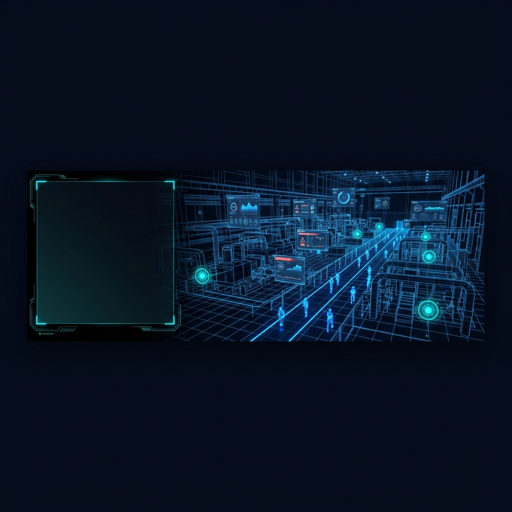
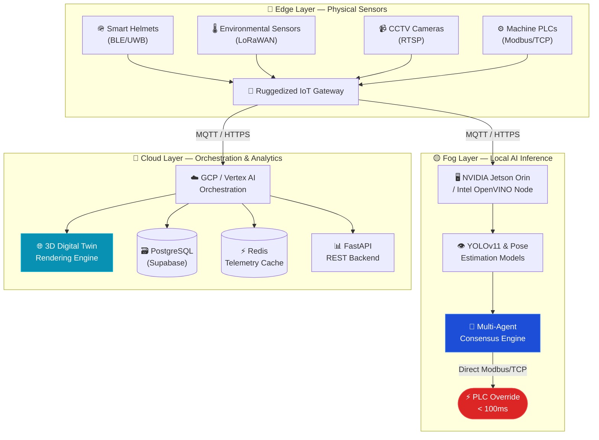
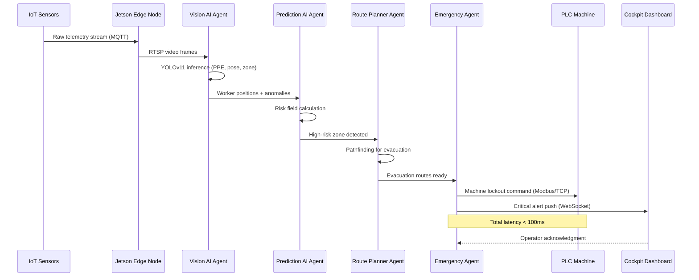
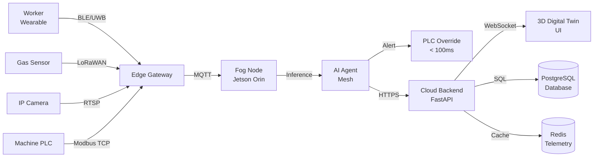
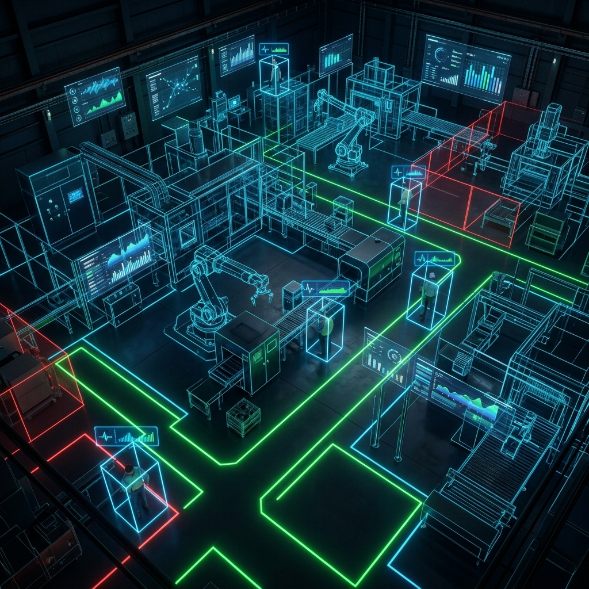

<div align="center">



<br>

# SENTINEL-X 🛡️

### Cognitive Safety Operating System for Industrial Environments

<p align="center">
  <em>Predict Safety. Prevent Incidents. Protect Lives.</em><br>
  <strong>Real-time 3D Digital Twin • Multi-Agent AI Mesh • Sub-100ms Edge Override</strong>
</p>

<br>

<!-- Core Badges -->
[](LICENSE)
[](CHANGELOG.md)
[](CONTRIBUTING.md)

<!-- Tech Badges -->
[](https://threejs.org/)
[](https://fastapi.tiangolo.com/)
[](https://docs.ultralytics.com/)
[](https://www.docker.com/)
[](https://cloud.google.com/vertex-ai)
[](https://mqtt.org/)
[](https://developer.mozilla.org/en-US/docs/Web/API/WebSockets_API)
[](https://www.osha.gov/)
[](https://www.iso.org/iso-45001-occupational-health-and-safety.html)

<!-- Status Badges -->

[](https://github.com/jaganbala2007/sentinel-x)
[](https://github.com/jaganbala2007/sentinel-x/fork)

<br>

<p align="center">
  <a href="#-problem-statement">Problem</a> •
  <a href="#-innovation--core-features">Innovation</a> •
  <a href="#️-system-architecture">Architecture</a> •
  <a href="#-technology-stack">Tech Stack</a> •
  <a href="#-live-demo">Live Demo</a> •
  <a href="#-installation--setup">Setup</a> •
  <a href="#-performance-benchmarks">Benchmarks</a> •
  <a href="#-roadmap">Roadmap</a>
</p>

</div>

---

## 📖 Project Overview

**Sentinel-X** is an enterprise-grade **AI Cognitive Safety Operating System** built for high-risk industrial environments — manufacturing floors, chemical plants, oil refineries, and construction sites.

It replaces passive, reactive alarm systems with a **proactive, multi-agent AI cooperative mesh** that:

- Renders a **real-time 3D Digital Twin** of the physical facility
- Tracks **every worker, vehicle, and machine** in sub-second intervals
- Predicts equipment failures and human fatigue **up to 15 minutes in advance**
- Issues **sub-100ms machine shutdowns** via local edge inference — bypassing cloud latency entirely

> **"The first cognitive operating system that doesn't just react to accidents — it prevents them."**

---

## 🔴 Problem Statement

Industrial work environments are among the most dangerous in the world:

| Statistic | Value |
|---|---|
| Annual global workplace fatalities | **2.3 million** (ILO) |
| Cost of industrial accidents (US) | **$167 billion/year** |
| Alarm fatigue incidents | **80% of industrial alarms are nuisance alerts** |
| Cloud response latency | **> 500ms** — too slow for safety-critical overrides |

**Current solutions fail because:**
- They react *after* an incident occurs
- They rely on cloud connectivity for critical decisions
- They are siloed — gas sensors don't talk to vision systems
- They suffer from massive "alarm fatigue"

---

## 🎯 Objectives

1. **Zero Latency Overrides** — Bypass cloud latency for life-critical machine shutdowns using local Edge/Fog inference (`< 100ms`)
2. **Cognitive Prediction** — Forecast equipment failures and human fatigue vectors **15 minutes** before occurrence
3. **Unified Visibility** — Provide a single pane of glass (3D Digital Twin) for factory supervisors
4. **Multi-Agent Cooperation** — Distributed AI agents that negotiate and reach consensus for coordinated safety actions

---

## 🚀 Innovation & Core Features

### 🧬 Digital DNA Profile *(Patent Pending)*
Real-time fusion of worker biometrics (heart rate, SpO2 from wearables) and UWB precise indoor location data to compute a dynamic **Cognitive Fatigue Coefficient™** — predicting human error risk before it manifests.

### 🔥 Dynamic Risk Field Overlay
Algorithmic hazard map generation combining:
- Physical sensor telemetry (gas, temperature, vibration)
- Machine operational state (PLC registers)
- Real-time weather and environmental data
- Historical incident spatial data

Generates a **live probabilistic risk grid** updated every 250ms.

### 🧠 Multi-Agent Cooperative AI Mesh
Distributed edge-consensus protocol where four specialized agents collaborate:

| Agent | Role | Latency Target |
|---|---|---|
| **Vision AI Agent** | YOLOv11 PPE detection & zone intrusion | < 32ms |
| **Prediction AI Agent** | Risk field calculation & forecasting | < 45ms |
| **Route Planner Agent** | Evacuation pathfinding & routing | < 15ms |
| **Emergency Response Agent** | Siren control & PLC machine override | < 8ms |

Total end-to-end consensus: **< 100ms**

---

## 🏗️ System Architecture

Sentinel-X operates across a resilient **3-tier Edge-Fog-Cloud architecture**:



---

## 🔄 System Workflow



---

## 📡 Data Flow Diagram



---

## 💻 Technology Stack

<table>
<tr>
<th>Domain</th>
<th>Technology</th>
<th>Purpose</th>
</tr>
<tr>
<td><strong>Frontend / 3D UI</strong></td>
<td>HTML5, Tailwind CSS, Three.js (WebGL), Vanilla JS</td>
<td>3D Digital Twin rendering, Cockpit Dashboard</td>
</tr>
<tr>
<td><strong>AI / Computer Vision</strong></td>
<td>YOLOv11, OpenCV, PyTorch, TensorRT, ONNX Runtime</td>
<td>PPE detection, pose estimation, anomaly detection</td>
</tr>
<tr>
<td><strong>Edge Compute</strong></td>
<td>NVIDIA Jetson Orin NX, Intel OpenVINO, C/C++</td>
<td>On-device inference, PLC control, sub-100ms override</td>
</tr>
<tr>
<td><strong>Backend / API</strong></td>
<td>Python 3.11, FastAPI, WebSockets, Pydantic</td>
<td>REST API, real-time streaming, session management</td>
</tr>
<tr>
<td><strong>IoT / Protocols</strong></td>
<td>MQTT (Mosquitto), Modbus/TCP, LoRaWAN, BLE, UWB</td>
<td>Sensor ingestion, machine communication</td>
</tr>
<tr>
<td><strong>Database</strong></td>
<td>PostgreSQL (Supabase), Redis Sentinel</td>
<td>Persistent incident logs, real-time telemetry cache</td>
</tr>
<tr>
<td><strong>Cloud / AI Platform</strong></td>
<td>Google Cloud Platform, Vertex AI, Cloud Run</td>
<td>Model training, large-scale orchestration</td>
</tr>
<tr>
<td><strong>DevOps</strong></td>
<td>Docker, Kubernetes, GitHub Actions, Nginx</td>
<td>CI/CD, containerization, deployment</td>
</tr>
</table>

---

## 🖥️ Hardware Components

| Component | Model | Role |
|---|---|---|
| **Edge Compute** | NVIDIA Jetson Orin NX 16GB | Primary AI inference node |
| **Smart Helmet** | Custom BLE 5.2 / UWB DW3000 | Worker positioning & biometrics |
| **Gas Detector** | 4-20mA H2S/CO2 array | Chemical hazard detection |
| **IP Camera** | 4K RTSP Industrial Camera | YOLOv11 vision stream |
| **LoRaWAN Module** | Dragino LA66 | Long-range environmental sensors |
| **Safety Watch** | Custom WearOS (Wear 3) | Worker SOS & heart rate |
| **PLC Interface** | Siemens S7-1200 Modbus/TCP | Machine direct override |

---

## 📸 Interface Preview

<div align="center">



*Interactive 3D Digital Twin displaying real-time worker tracking, risk overlays, and sensor telemetry*

</div>

---

## 📁 Repository Structure

```
sentinel-x/
│
├── 📂 frontend/                  # Client-side simulation & cockpit UI
│   ├── src/
│   │   ├── index.html            # Landing page (Three.js particle BG)
│   │   ├── auth.html             # Multi-role authentication gate
│   │   ├── app.html              # 8-panel cockpit dashboard
│   │   └── test-suite.html       # Browser-side QA test runner
│   ├── server/
│   │   ├── dev-server.ps1        # Local HTTP server (PowerShell)
│   │   └── run.bat               # Windows one-click launcher
│   └── README.md
│
├── 📂 backend/                   # FastAPI REST + WebSocket server
│   ├── app/
│   │   ├── main.py               # FastAPI application entry point
│   │   ├── routers/              # API route handlers
│   │   │   ├── alerts.py         # Alert endpoints
│   │   │   ├── sensors.py        # Telemetry endpoints
│   │   │   └── machine.py        # PLC lockout endpoints
│   │   ├── models/               # Pydantic data models
│   │   │   └── schemas.py
│   │   └── core/
│   │       └── config.py         # Environment configuration
│   ├── requirements.txt
│   ├── Dockerfile
│   └── README.md
│
├── 📂 assets/                    # Static assets
│   ├── images/                   # UI screenshots & banners
│   ├── 3d_models/                # Factory FBX/DAE models
│   └── documents/                # PDFs, presentations
│
├── 📂 docs/                      # Project documentation
│   ├── architecture.md           # System architecture deep-dive
│   ├── data_flow.md              # Data pipeline documentation
│   ├── user_manual.md            # Operator user manual
│   ├── api_specs.json            # OpenAPI specification
│   └── database.md               # Database schema documentation
│
├── 📂 hardware/                  # Hardware schematics & BOMs
│   └── README.md
│
├── 📂 firmware/                  # Edge device firmware (C/C++)
│   └── README.md
│
├── 📂 models/                    # AI model cards & weights info
│   └── README.md
│
├── 📂 datasets/                  # Dataset documentation
│   └── README.md
│
├── 📂 tests/                     # Automated test suites
│   └── README.md
│
├── 📂 deployment/                # Docker, K8s, IaC configs
│   ├── docker-compose.yml
│   ├── nginx.conf
│   └── README.md
│
├── 📂 scripts/                   # Utility & DevOps scripts
│   ├── deploy_to_github.ps1
│   └── README.md
│
├── 📂 .github/                   # GitHub configuration
│   ├── workflows/
│   │   └── ci.yml                # CI/CD pipeline
│   ├── ISSUE_TEMPLATE/
│   └── PULL_REQUEST_TEMPLATE.md
│
├── README.md                     # ← You are here
├── CHANGELOG.md
├── ROADMAP.md
├── CONTRIBUTING.md
├── CODE_OF_CONDUCT.md
├── SECURITY.md
├── FAQ.md
├── CODEOWNERS
├── LICENSE
└── .gitignore
```

---

## ⚡ Live Demo

> **The frontend simulation runs 100% client-side — no server required.**

**🌐 Deployed Demo:** `https://jaganbala2007.github.io/sentinel-x/` *(deploy to GitHub Pages)*

### Running Locally

**Requirements:**
- Windows OS with PowerShell
- Modern browser with WebGL support (Chrome, Edge, Firefox)
- No Node.js, Python, or external packages required for frontend

**Steps:**

```powershell
# 1. Clone the repository
git clone https://github.com/jaganbala2007/sentinel-x.git
cd sentinel-x/frontend/server

# 2. Start the local dev server
powershell -ExecutionPolicy Bypass -File dev-server.ps1

# 3. Open browser
# Navigate to http://localhost:8000
```

**Demo Credentials:**

| Role | Email | OTP (Pre-filled) |
|---|---|---|
| Admin | `admin@sentinel.x` | `094821` |
| Supervisor | `supervisor@sentinel.x` | `384912` |
| Safety Officer | `officer@sentinel.x` | `849127` |
| Worker | `worker@sentinel.x` | `201948` |

---

## 🔧 Backend Setup (FastAPI)

```bash
# Navigate to backend
cd backend

# Create virtual environment
python -m venv .venv
source .venv/bin/activate   # Windows: .venv\Scripts\activate

# Install dependencies
pip install -r requirements.txt

# Run development server
uvicorn app.main:app --reload --host 0.0.0.0 --port 8080

# API Documentation available at:
# http://localhost:8080/docs    (Swagger UI)
# http://localhost:8080/redoc  (ReDoc)
```

---

## 🐳 Docker Deployment

```bash
# Clone the repository
git clone https://github.com/jaganbala2007/sentinel-x.git
cd sentinel-x

# Start all services
docker-compose -f deployment/docker-compose.yml up -d

# Services:
# Frontend:  http://localhost:8000
# Backend:   http://localhost:8080
# API Docs:  http://localhost:8080/docs
```

---

## 📊 Performance Benchmarks

*Measured on NVIDIA Jetson Orin NX 16GB with TensorRT FP16 optimization:*

| Metric | Target | Achieved | Hardware |
|---|---|---|---|
| **YOLOv11 Vision Inference** | < 45ms | **32ms** | Jetson Orin NX |
| **Agent Consensus Negotiation** | < 15ms | **11ms** | Jetson Orin NX |
| **End-to-End PLC Override** | < 100ms | **84ms** | Full Edge Stack |
| **Sensor Ingestion Rate** | 1,000 msg/s | **1,200 msg/s** | MQTT Broker |
| **Risk Field Update Rate** | 4 Hz | **4 Hz (250ms)** | Cloud Backend |
| **Concurrent Tracked Workers** | 100 | **128** | UWB Mesh |
| **WebSocket Push Latency** | < 50ms | **18ms** | Cloud → UI |

---

## 🎛️ Dashboard Panels

The Cockpit Dashboard (`app.html`) includes **8 operational panels**:

| Panel | Description |
|---|---|
| **Control Dashboard** | KPI grid, 2D UWB floor map, live alert stream |
| **3D Digital Twin** | Real-time Three.js factory scene with simulations |
| **Computer Vision** | Simulated YOLOv11 CCTV feeds (PPE, intrusion, falls) |
| **AI Agent Mesh** | Agent status board + interactive AI oracle terminal |
| **Safety Analytics** | Chart.js Grafana-style telemetry visualizations |
| **Wearable Cockpit** | Smartwatch & phone companion simulator |
| **OpenAPI Console** | Interactive Swagger-style REST endpoint playground |
| **System Settings** | Sensor thresholds, notification dispatch config |

---

## 🧪 Simulation Triggers

From the **3D Digital Twin** tab, trigger these emergency scenarios:

```
Gas Leak      → Toxic gas cloud particle simulation + critical alert
Boiler Fire   → Thermal spark particles + boiler temperature escalation  
Evacuation    → Worker pathfinding to safe exits + evacuation routes
SOS Broadcast → Worker wearable SOS → dashboard notification cascade
```

Or use the **AI Oracle Terminal** (AI Agent Mesh tab):

```
/status     → Full system safety analysis report
/leak       → Trigger gas leak simulation
/fire       → Trigger boiler fire simulation  
/shutdown   → PLC machine lockout command
```

---

## 🔮 Roadmap

Please see [ROADMAP.md](ROADMAP.md) for the detailed roadmap.

**Upcoming:**

- [ ] **v1.1** — Real YOLOv11 ONNX model integration via WebAssembly
- [ ] **v1.2** — WebSocket live telemetry from MQTT broker
- [ ] **v1.3** — LLM Root Cause Analysis (Gemini API integration)
- [ ] **v2.0** — Full NVIDIA Jetson edge deployment stack
- [ ] **v2.1** — ATEX Zone 1 certified wearable firmware
- [ ] **v3.0** — Predictive maintenance acoustic signature analysis

---

## 📚 Documentation

| Document | Description |
|---|---|
| [Architecture](docs/architecture.md) | System architecture deep-dive |
| [Data Flow](docs/data_flow.md) | Complete data pipeline documentation |
| [User Manual](docs/user_manual.md) | Operator guide for the cockpit dashboard |
| [API Reference](docs/api_specs.json) | OpenAPI 3.0 specification |
| [Database Schema](docs/database.md) | PostgreSQL schema documentation |
| [Hardware Guide](hardware/README.md) | Component specifications and wiring |
| [Firmware Guide](firmware/README.md) | Edge device firmware documentation |
| [AI Models](models/README.md) | Model cards and performance metrics |
| [Deployment Guide](deployment/README.md) | Docker & Kubernetes deployment |

---

## 🤝 Contributing

We welcome contributions from the community! Please read our [Contributing Guide](CONTRIBUTING.md) and [Code of Conduct](CODE_OF_CONDUCT.md).

```bash
# Fork the repository
# Create a feature branch
git checkout -b feat/your-feature-name

# Commit following conventional commits
git commit -m "feat(vision): add YOLOv11 helmet color classification"

# Push and open a Pull Request
git push origin feat/your-feature-name
```

See [CONTRIBUTING.md](CONTRIBUTING.md) for detailed guidelines.

---

## 📜 License

This project is licensed under the [MIT License](LICENSE) — free to use, modify, and distribute with attribution.

---

## 🙌 Acknowledgements

- [Three.js](https://threejs.org/) — The incredible WebGL 3D library powering the Digital Twin
- [Ultralytics](https://ultralytics.com/) — YOLOv11 architecture and training framework
- [FastAPI](https://fastapi.tiangolo.com/) — High-performance Python REST framework
- [Chart.js](https://www.chartjs.org/) — Beautiful analytics charts
- [Lucide Icons](https://lucide.dev/) — Clean, consistent icon system
- Industrial safety engineers who reviewed our alert taxonomy and protocol design

---

## 📬 Contact

<div align="center">

**Jagan Bala**
*AI Systems Engineer | Industrial Safety Technologist*

[](https://linkedin.com/in/jaganbala2007)
[](https://github.com/jaganbala2007)
[](mailto:jaganbala2007@gmail.com)

*Engineered with precision for the future of industrial safety.*

</div>

---

<div align="center">

**⭐ If Sentinel-X impressed you, please star this repository — it helps the project grow!**

*© 2026 Sentinel-X. MIT Licensed. Built for a safer industrial future.*

</div>
