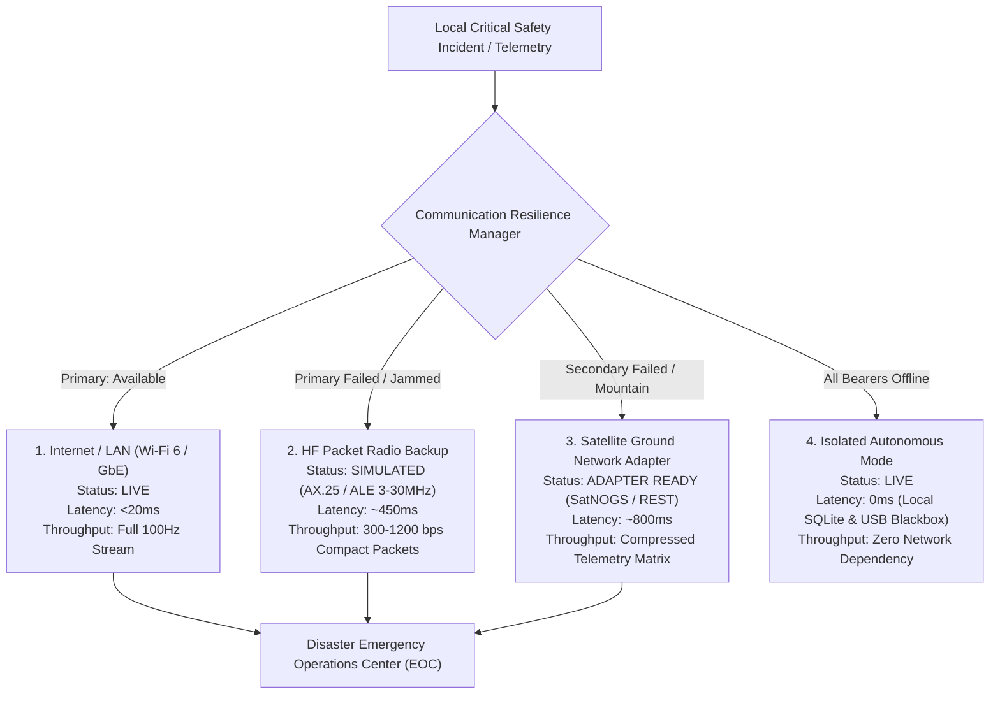

# 📡 Sentinel-X Communication Resilience Architecture

**Document Version:** 2.4.0  
**Design Standard:** Disruption-Tolerant Multi-Bearer Hybrid Networking  
**Classification:** Modular Abstraction (Internet: `LIVE`, HF Radio: `SIMULATED`, Satellite: `ADAPTER READY`)

---

## 1. Multi-Bearer Priority Hierarchy



---

## 2. High-Frequency (HF) Packet Radio Simulation Model

*Note: HF is High-Frequency Ionospheric Radio (3–30 MHz) operating via Automatic Link Establishment (ALE) or AX.25, which is fundamentally distinct from 868/915 MHz LoRa.*

Sentinel-X models physical HF radio propagation in software:

### 2.1 Simulation Parameters
- **Carrier Frequency:** 7.050 MHz / 14.100 MHz simulated ionospheric skywave.
- **Modulation Scheme:** PSK31 / 4-FSK with Forward Error Correction (Reed-Solomon).
- **Packet Overhead:** 16-byte AX.25 header, 4-byte CRC-32, 64-byte payload.
- **Ionospheric Degradation Model:**
  $$\text{SNR}_{\text{effective}} = \text{SNR}_{\text{base}} - \text{SolarAbsorption}(\text{Flux}) + \text{MultiPathFading}(t)$$
- **Retransmission:** Automatic Repeat reQuest (ARQ) with max 5 retries and exponential jitter.

---

## 3. Satellite Ground Station Adapter Architecture

Sentinel-X includes a REST/JSON adapter for connecting to open-source satellite ground stations (e.g., SatNOGS / Libre Space):

```python
class SatelliteAdapter:
    def __init__(self, endpoint_url: str = "http://127.0.0.1:8080/api/v1/adapters/satellite"):
        self.endpoint = endpoint_url
        self.status = "ADAPTER READY"

    def transmit_downlink_packet(self, telemetry_payload: dict) -> dict:
        """
        Formats and transmits compressed 64-byte telemetry burst 
        to orbital pass scheduler.
        """
        compact_binary = compress_payload(telemetry_payload)
        return {
            "status": "QUEUED_FOR_PASS",
            "satellite_id": "SATNOGS-LEO-01",
            "next_pass_utc": "2026-09-09T09:45:00Z",
            "elevation_deg": 48.2,
            "bytes_transmitted": len(compact_binary)
        }
```

---

## 4. Isolated Autonomous Mode Behavior

When all physical communication interfaces are offline or disconnected:
1. The **Sensor Trust Engine** continues 100Hz physical evaluation.
2. The **Deterministic Safety Engine** continues evaluating hazard rules.
3. If an anomaly escalates to `CRITICAL`, **hardware relays trip locally in <800ms**.
4. The incident record is written to both **SQLite WAL** and **USB storage**.
5. When any network link recovers, the store-and-forward queue flushes all records in strict chronological order with cryptographic validation.
