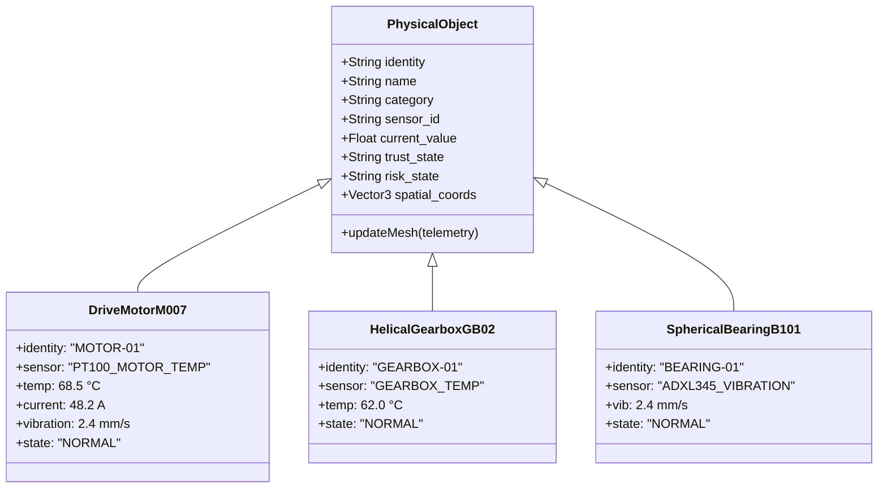

# 🌐 Sentinel-X 3D Operational Digital Twin Specification

**Document Version:** 2.4.0  
**Rendering Engine:** Three.js / WebGL running at 60 FPS  
**Classification:** `LIVE` & `PHYSICALLY BOUND TO TELEMETRY`  
**Core Invariant:** *The digital twin is an operational telemetry mirror, not decorative 3D graphics.*

---

## 1. Operational Digital Twin Mapping

Every 3D object in the Sentinel-X viewport maps directly to physical device IDs, sensor streams, trust scores, and risk states:

---

## 2. Dynamic Physics & Visual State Feedback

When real or simulated telemetry changes, the 3D meshes react immediately:

1. **Drive Motor M-01 (`MOTOR-01`):**
   - Normal ($<70^\circ\text{C}$): Deep industrial cast-iron gray (`#223028`).
   - Warning ($80-89^\circ\text{C}$): Pulsing amber thermal glow (`#f59e0b`).
   - Critical ($\ge 90^\circ\text{C}$): Bright red warning emissive with emergency contactor trip indicator.

2. **Drive Bearing B-101 (`BEARING-01`):**
   - Visual vibration displacement amplitude directly modulated by `ADXL345` RMS velocity ($A \propto v_{\text{RMS}}$).
   - High-frequency harmonic oscillation shader activated when spectral defect frequency is detected.

3. **Vulcanized Rubber Belt (`BELT-01`):**
   - Texture offset animation synchronized with motor drive speed (0 to 3.5 m/s).
   - Stops immediately upon relay trip or E-Stop activation.

4. **Warning Beacon & Siren (`SIREN-01`):**
   - Flashing point light source with rotating ambient flare and visual acoustic shockwave rings.

---

## 3. Interactive Raycasting & Spatial Pins

- Clicking or hovering over any 3D equipment component casts a ray via `THREE.Raycaster`.
- Pops up the real-time **SCADA Inspection HUD**:
  - Live parameter values (`PT100`, `ADXL345`, `ACS712`, `VL53L1X`).
  - Sensor trust score and Byzantine verification state.
  - Provable source tag (`LIVE` from ESP32 or `SIMULATED`).
  - Last verified timestamp from SQLite WAL ledger.
