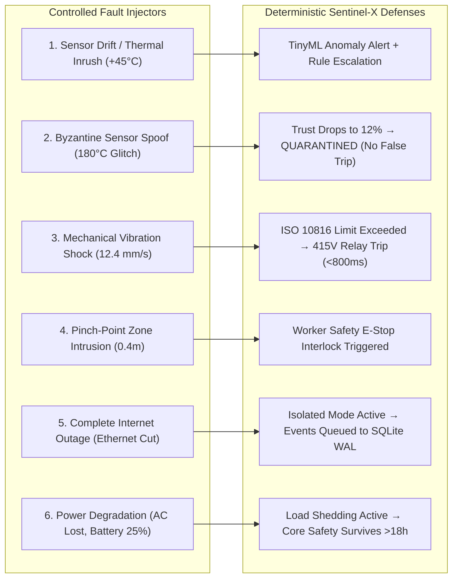

# 🧪 Sentinel-X Fault Injection & Stress Testing Lab

**Document Version:** 2.4.0  
**Purpose:** Controlled Physical and Cyber Fault Injection Framework for SIH Judges  
**Verification:** Validates edge resilience under failure modes

---

## 1. Fault Injection Test Catalog

---

## 2. Step-by-Step Fault Verification Guide

### Test 1: Byzantine Sensor Spoofing
- **Command / Trigger:** In the Mission Cockpit, select `INJECT FAULT: SPOOF PT100 (180°C)`.
- **Expected System Response:**
  1. Sensor Trust Engine detects a $11,200^\circ\text{C/s}$ step rate-of-change violation.
  2. PT100 Trust Score drops from 99% to 12.5% (`QUARANTINED`).
  3. Risk Engine **DOES NOT TRIP** the motor.
  4. SCADA Cockpit highlights the faulty node in orange/red with explanation: *"Unphysical thermal gradient without mechanical load correlation."*

### Test 2: Catastrophic Internet Disconnect
- **Command / Trigger:** Toggle `COMMUNICATION BLACKOUT` switch in the cockpit.
- **Expected System Response:**
  1. Primary Internet indicator turns red (`FAILED`).
  2. System enters **Isolated Autonomous Mode**.
  3. Induce physical or simulated thermal overload: **Hardware relay trips locally in <800ms**.
  4. Local SQLite WAL and USB Blackbox record the incident (`PENDING_STORE_FORWARD`).
  5. HF Packet Radio simulation transmits emergency alert packet.
  6. Reconnect Internet: Store-and-forward queue synchronizes all records with zero data loss.
