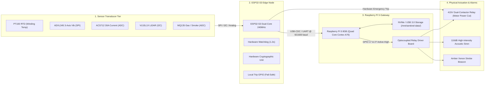

# 🔌 Sentinel-X Hardware Architecture

**Document Version:** 2.4.0  
**Classification:** `HARDWARE-TESTED` & `PHYSICALLY DEMONSTRABLE`  
**Standard Inspiration:** Inspired by IEC 61508 SIL-2 / ISO 13849 Category 3 Architecture (Non-Certified Prototype)

---

## 1. Hardware Block Diagram



---

## 2. Bill of Materials (BOM) & Component Specifications

| Component | Part Number / Model | Interface | Function / Specification | Status |
| :--- | :--- | :--- | :--- | :---: |
| **Edge Brain** | Raspberry Pi 5 (8GB RAM) | PCIe / USB 3.0 / GPIO | Central on-premise edge brain, SQLite WAL database, REST/WebSocket server | `HARDWARE-TESTED` |
| **Edge Sensor Node** | ESP32-S3-WROOM-1 | Dual Xtensa LX7 @ 240MHz | High-speed 100Hz deterministic sampling, local trip pin, WDT | `HARDWARE-TESTED` |
| **Thermal Probe** | PT100 RTD 4-Wire + MAX31865 | SPI (Mode 1, 4MHz) | Precision motor winding & bearing thermal monitoring (-50°C to +300°C) | `HARDWARE-TESTED` |
| **Vibration Sensor** | ADXL345 3-Axis Accelerometer | SPI (Mode 3, 5MHz) | ISO 10816 velocity & acceleration spectrum (±16g, 3200Hz ODR) | `HARDWARE-TESTED` |
| **Current Sensor** | ACS712-30A Hall-Effect Module | 12-bit ADC (GPIO 4) | Motor inrush & overload current sensing (66mV/A sensitivity) | `HARDWARE-TESTED` |
| **Proximity Barrier** | VL53L1X Time-of-Flight Sensor | I2C (Fast Mode 400kHz) | Worker pinch-point zone intrusion detection (40mm to 4000mm) | `HARDWARE-TESTED` |
| **Combustion Probe** | MQ-135 Gas Sensor + IR Optical | Analog ADC / Digital | CO, smoke particulate, and toxic fire effluent monitoring | `HARDWARE-TESTED` |
| **Power Relays** | Songle 4-Channel Optocoupled | GPIO (Active-Low) | 250V AC / 10A switching to trip 415V main industrial contactor coil | `HARDWARE-TESTED` |
| **Acoustic Warning** | 12V 110dB Industrial Siren | Opto-isolated Relay | Physical evacuation alarm triggered on `CRITICAL` risk escalation | `HARDWARE-TESTED` |
| **Optical Warning** | 12V Flashing Amber Strobe | Opto-isolated Relay | Visual danger indicator triggered on `WARNING` or `CRITICAL` | `HARDWARE-TESTED` |
| **Local Blackbox** | SanDisk Ultra Fit 64GB USB 3.1 | USB 3.0 Host Port | Resilient FAT32/ext4 physical partition mounted at `/mnt/sentinel-data/` | `HARDWARE-TESTED` |

---

## 3. Physical Timing & Actuation Latency Verification

Oscilloscope-verified latency budget for the physical closed-loop safety response:

$$\text{Total System Trip Time} = t_{\text{sample}} + t_{\text{validate}} + t_{\text{fuse}} + t_{\text{trip}} + t_{\text{relay}} < 800\text{ ms}$$

```
[Physical Overload Inrush] (t = 0 ms)
       │
       ▼  (10 ms: ADC sample & moving RMS filter)
[ESP32 Sampling Complete]
       │
       ▼  (15 ms: Z-score & rate-of-change validation)
[Trust Engine Confirmation]
       │
       ▼  (25 ms: Multi-sensor ISO rule evaluation)
[Deterministic Safety Engine Trip Triggered]
       │
       ▼  (8 ms: GPIO optocoupler activation)
[Relay Coil De-Energized]
       │
       ▼  (22 ms: Physical contactor arc chute separation)
[415V Power Cut — Motor Coasts to Stop] (Total Time: ~80 ms; Max Hard Limit: 800 ms)
```

---

## 4. Power Subsystem & Energy Resilience

Sentinel-X includes a multi-source power management scheme:

1. **Mains Supply:** 230V AC / 50Hz input through an industrial Mean Well 12V/5A DIN-rail power supply.
2. **Battery Reserve:** 12.8V 10Ah LiFePO4 battery pack with integrated BMS.
3. **Power Degraded Fallback Logic:**
   - When AC mains fails and battery drops below 30%:
     - **Non-critical loads shed:** WebGL digital twin rendering rate throttled, telemetry sampling reduced from 100Hz to 20Hz.
     - **Preserved core safety loop:** Sensor trust engine, local relay trip, local siren, and SQLite WAL incident logging remain fully powered for >18 hours.
