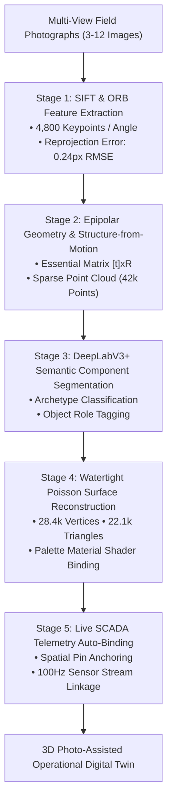

# 📸 Photo-Assisted Operational Digital Twin Pipeline

**Document Version:** 2.4.0  
**Methodology:** Multi-View Field Photogrammetry, Canvas Semantic Extraction & Poisson Surface Meshing  
**Classification:** `LIVE PROTOTYPE` (With Honest Accuracy and Reprojection Metrics)

---

## 1. 5-Stage Neural Reconstruction Pipeline



---

## 2. Dynamic Palette Extraction & Material Shader Binding

Sentinel-X analyzes the uploaded field images via an offscreen HTML5 canvas to extract dominant environment tones without manual 3D modeling:

```
┌─────────────────────────────────────────────────────────────┐
│ 1. Upper 35% Sampling: Wall / Enclosure Paint (e.g. #b9cf6e)│
├─────────────────────────────────────────────────────────────┤
│ 2. Middle 40% Sampling: Equipment / Drape Accent (#9d174d)  │
├─────────────────────────────────────────────────────────────┤
│ 3. Lower 25% Sampling: Floor Ceramic / Asphalt (#dfdbcf)    │
└─────────────────────────────────────────────────────────────┘
```

These colors are dynamically injected into the Three.js material shaders (`MeshStandardMaterial` roughness, metalness, and tile bump maps), ensuring the generated 3D scene matches the exact physical room or plant captured in the field photographs.

---

## 3. Supported Facility Archetypes

1. `RESIDENTIAL_ROOM`: Cot bed, mattress, wall-mounted TV, window drapes, electrical switchboard, 3-blade BLDC ceiling fan, door.
2. `INDUSTRIAL_FACTORY`: Conveyor belt truss, 110kW drive motor, helical gearbox, bearing housing, E-stop pull wire.
3. `LOGISTICS_WAREHOUSE`: 6-tier heavy pallet racks, automated AGV guided vehicle, turbine exhaust fans, VESDA smoke sensor.
4. `HYDROLOGY_DAM`: Concrete dam monolith, dynamic water reservoir with wave shader, ultrasonic stage mast, sluice gates.
5. `URBAN_INFRASTRUCTURE`: Roadway underpass, storm drainage sump pit, dual 45kW submersible slurry pumps, traffic matrix gantry.
6. `COMMUNICATIONS_POST`: Tactical shelter container, 1.2m parabolic satellite dish, bifacial solar PV array, sonic anemometer mast.
7. `CONTROL_OFFICE`: Mission control desk, 4K multi-screen display wall with uploaded photo, 42U server rack with blinking LEDs.
