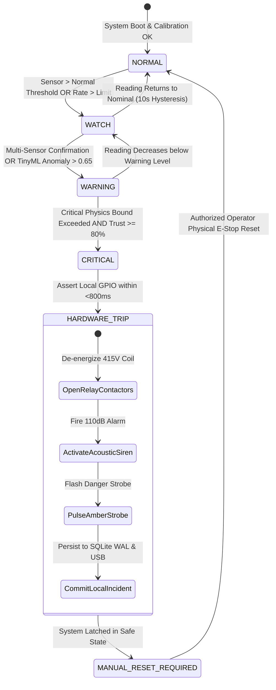

# 🛡️ Sentinel-X Deterministic Safety Architecture

**Document Version:** 2.4.0  
**Design Standard:** Industrial Deterministic Safety Interlocks (Inspired by ISO 13849 Category 3 / IEC 61508 SIL-2)  
**Core Invariant:** *Safety decisions must execute locally in <800ms without cloud, Internet, or LLM dependency.*

---

## 1. Safety State Machine

---

## 2. Quantitative Safety Thresholds (Industrial Conveyor Baseline)

| Parameter | Unit | `NORMAL` | `WATCH` | `WARNING` | `CRITICAL` (Immediate Trip) | Standard Reference |
| :--- | :---: | :---: | :---: | :---: | :---: | :--- |
| **Motor Winding Temp** | °C | $\le 70.0$ | $70.1 - 79.9$ | $80.0 - 89.9$ | $\ge 90.0$ | IEC 60034-1 Class F Insulation |
| **Drive Bearing Vibration** | mm/s | $\le 2.8$ | $2.9 - 4.4$ | $4.5 - 7.0$ | $\ge 7.1$ | ISO 10816-3 Class II (Unrestricted) |
| **Motor 3-Phase Current** | A | $\le 52.0$ | $52.1 - 64.9$ | $65.0 - 81.9$ | $\ge 82.0$ (Jam Overload) | NEMA Overcurrent Protection |
| **Pinch-Point Proximity** | m | $\ge 2.5$ | $1.5 - 2.4$ | $0.8 - 1.4$ | $\le 0.7$ (Worker in Danger) | ISO 13857 Machine Guarding |
| **Smoke / Particulate** | %/m | $\le 0.4$ | $0.5 - 1.4$ | $1.5 - 3.9$ | $\ge 4.0$ (Combustion Infiltration) | EN 54-20 Optical Smoke Standard |

---

## 3. Strict Safety Invariants

### 3.1 LLM & Cloud Exclusion
- Large Language Models (LLMs) and cloud APIs are strictly classified as **Tier-3 Non-Safety Advisory Observers**.
- **Architectural Firewall:** No network packet from a cloud API or LLM endpoint has write access to the hardware GPIO trigger bus.

### 3.2 Byzantine Sensor Protection
- If a single temperature sensor suddenly spikes from 68°C to 180°C in a single 10ms frame, while bearing vibration, motor current, and thermal neighbors remain nominal:
  1. The **Sensor Trust Engine** flags the reading as a physical rate-of-change violation ($>50^\circ\text{C/s}$).
  2. Trust score drops from 99% to 12% (`QUARANTINED`).
  3. The Deterministic Safety Engine ignores the quarantined sensor and bases plant decisions on remaining trusted evidence, **preventing false-positive production shutdowns**.
