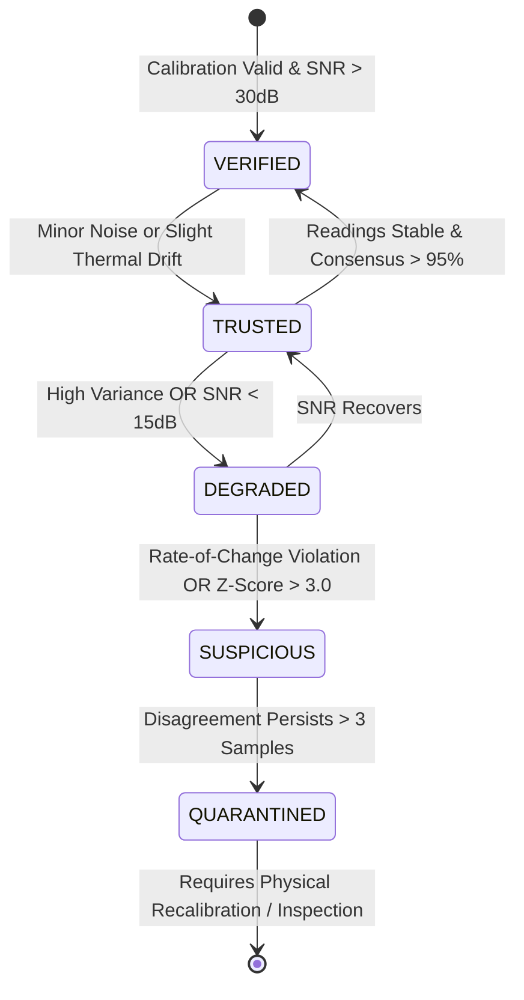

# 🔍 Sentinel-X Sensor Trust & Byzantine Fault Tolerance Engine

**Document Version:** 2.4.0  
**Algorithm:** Multi-Factor Statistical Physics Validation & Cross-Sensor Consensus Scoring  
**Core Invariant:** *Never blindly trust a single sensor.*

---

## 1. Trust Scoring Mathematical Formulation

The trust score $T_i \in [0, 100]$ for sensor $i$ at time $t$ is computed via a weighted multi-factor evaluation:

$$T_i(t) = w_p \cdot P_i + w_r \cdot R_i + w_c \cdot C_i + w_n \cdot N_i + w_h \cdot H_i$$

Where weights satisfy $\sum w = 1.0$:
- **$P_i$ (Physical Plausibility Score - $w_p = 0.25$):** Evaluates if value is within physical transducer limits ($V_{\min} \le v_i \le V_{\max}$).
- **$R_i$ (Rate-of-Change Limit - $w_r = 0.25$):** Penalizes unphysical step changes:
  $$R_i = \max\left(0, 1.0 - \frac{|\Delta v_i / \Delta t|}{\dot{V}_{\max}}\right)$$
- **$C_i$ (Cross-Sensor Correlation - $w_c = 0.25$):** Compares correlated physics channels (e.g., motor thermal rise must correlate with load current integral $\int I^2 dt$).
- **$N_i$ (Spatial Neighbor Consensus - $w_n = 0.15$):** Evaluates Z-score against redundant sensor nodes in the same cluster:
  $$Z_i = \frac{|v_i - \mu_{\text{cluster}}|}{\sigma_{\text{cluster}} + \epsilon}$$
- **$H_i$ (Device Health & Communication Quality - $w_h = 0.10$):** Incorporates SNR, packet drop rate, and internal ADC temperature.

---

## 2. Sensor Trust States & State Machine

| Trust Classification | Score Range | Operational Meaning | Safety Engine Handling |
| :--- | :---: | :--- | :--- |
| **`VERIFIED`** | $95 - 100\%$ | High-confidence data confirmed by physics and redundant cluster. | Fully trusted for automated safety control and cloud archival. |
| **`TRUSTED`** | $80 - 94\%$ | Nominal operating reading within all physical rate limits. | Standard operational data; active in safety decision matrix. |
| **`DEGRADED`** | $50 - 79\%$ | Elevated noise floor, low battery voltage, or minor drift. | Weighted down in risk engine; warning flag raised on SCADA cockpit. |
| **`SUSPICIOUS`** | $20 - 49\%$ | Unphysical step jump or sharp disagreement with neighbors. | Temporarily excluded from safety actuator tripping decisions. |
| **`QUARANTINED`** | $0 - 19\%$ | Confirmed transducer short-circuit, open wire, or spoofing. | **Completely isolated**. Plant runs on remaining trusted sensor cluster. |

---

## 3. Concrete Physical Example (Sensor Spoofing Defense)

### Scenario: Sudden 180°C Spike on Single Bearing Sensor
1. **Physical Event:** A thermal transducer cable is damaged or an attacker injects a malicious 180°C reading into Node 1.
2. **Cluster Context:**
   - PT100 Sensor A (Node 1): 180.0°C (Instantaneous jump from 68°C in 10ms: $\Delta T / \Delta t = 11,200^\circ\text{C/s}$).
   - PT100 Sensor B (Node 2): 68.7°C.
   - ADXL345 Vibration: 2.4 mm/s (Normal).
   - ACS712 Motor Current: 48.2 A (Normal).
3. **Trust Engine Output:**
   - Rate limit violated ($\dot{V}_{\max} = 15^\circ\text{C/s}$): $R_i = 0.0$.
   - Cross-correlation violated (no current or vibration surge): $C_i = 0.0$.
   - Neighbor Z-score ($Z = 8.4$): $N_i = 0.0$.
   - **Calculated Trust Score = 12.5% (`QUARANTINED`).**
4. **Result:** The system **DOES NOT TRIP** the motor. It logs a `SENSOR_FAULT_QUARANTINE` incident, continues operating on Sensor B, and alerts the maintenance technician.
