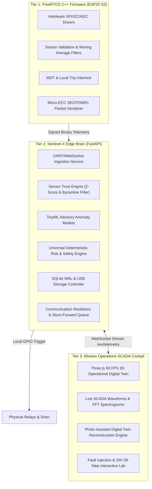

# 💻 Sentinel-X Software Architecture

**Document Version:** 2.4.0  
**Frameworks:** FastAPI (Python 3.11), Three.js (WebGL), FreeRTOS (C++17 ESP-IDF), SQLite3 WAL  
**Design Standard:** Strict Separation of Concerns between Probabilistic Intelligence and Deterministic Safety Control

---

## 1. Multi-Tier Software Architecture



---

## 2. Directory & Module Mapping

```
tata/
├── backend/                        # Edge Brain Core (Python 3.11 / FastAPI)
│   ├── app/
│   │   ├── core/                   # System config, logging, SQLite WAL database connector
│   │   ├── routers/                # REST & WebSocket API endpoints
│   │   │   ├── environment.py      # Multi-environment switcher & profile discovery
│   │   │   ├── telemetry.py        # Live sensor streams & historical query
│   │   │   ├── system.py           # E-Stop, relay trips, and hardware health
│   │   │   └── sih_demo.py         # 28-Step interactive judge demo controller
│   │   ├── schemas/                # Pydantic universal data contracts
│   │   └── services/               # Safety & intelligence algorithms
│   │       ├── sensor_trust_engine.py      # Z-score, rate limits & Byzantine quarantine
│   │       ├── universal_risk_engine.py    # ISO 13849 deterministic safety engine
│   │       ├── communication_manager.py    # Store-and-forward & multi-channel routing
│   │       └── adapters/                   # HF Radio & Satellite protocol adapters
├── firmware/                       # Embedded Edge Node Tier
│   └── sensor_node/main/
│       ├── main.cpp                # 100Hz deterministic FreeRTOS loop
│       ├── sensor_manager.h        # PT100, ADXL345, ACS712, VL53L1X drivers
│       └── safety_controller.h     # Local fail-safe trip logic & WDT service
├── frontend/                       # Mission Cockpit & 3D Operational Twin
│   ├── src/
│   │   ├── app.html                # Unified dark SCADA cockpit & WebGL canvas
│   │   └── twin-engine.js          # Procedural 3D multi-archetype generator
│   └── server.js                   # Node.js static & reverse proxy server
└── docs/                           # Official Technical & Verification Documentation
```

---

## 3. Key Software Design Principles

### 3.1 Absolute Decoupling of AI from Actuators
- The **TinyML engine** calculates a probabilistic anomaly score $A \in [0.0, 1.0]$.
- The **Deterministic Safety Engine** checks hard physical limits:
  $$\text{Safety Action} = f(T_{\text{trusted}}, V_{\text{trusted}}, I_{\text{trusted}}, R_{\text{rate}}) \quad \text{where } \text{Trust} \ge 80\%$$
- **Rule:** An anomaly score alone will NEVER shut down a plant unless confirmed by trusted physical telemetry limits.

### 3.2 Resilience Against Database & Disk Lockups
- SQLite Write-Ahead Logging (WAL) mode enables concurrent reads during high-frequency telemetry writes.
- In-memory ring-buffer caches the latest 2,048 samples; if the physical disk becomes temporarily busy or USB media is swapped, telemetry is never dropped.
