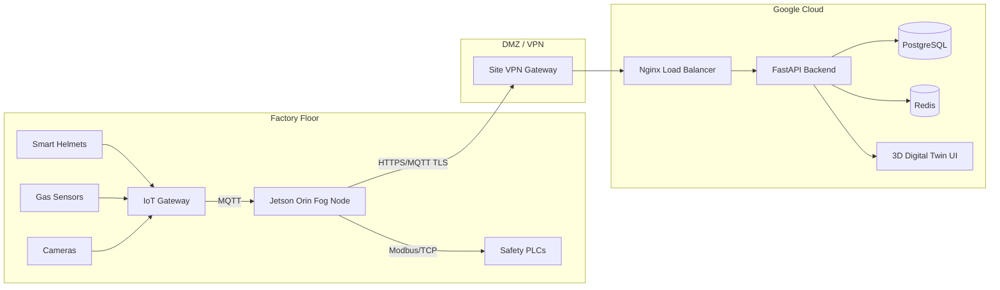

# Sentinel-X System Architecture

## Overview

Sentinel-X operates across a **three-tier Edge-Fog-Cloud architecture** optimized for industrial safety:

- **Edge Layer** — Raw sensor data collection (IoT devices, cameras, wearables)
- **Fog Layer** — Local AI inference and machine control (NVIDIA Jetson Orin)
- **Cloud Layer** — Centralized analytics, Digital Twin, and remote cockpit

The design prioritizes **local autonomy**: all safety-critical decisions execute at the Fog Layer without cloud dependency, guaranteeing operation during network outages.

---

## Tier 1 — Edge Layer (Sensors & IoT)

### Components

| Component | Technology | Data Produced |
|---|---|---|
| Smart Helmets | BLE 5.2 / UWB DW3000 | Position (x,y,z), heart rate, SpO2, fall detection |
| Gas Detectors | 4-20mA current loop → MQTT | CO2 (ppm), H2S (ppm), LEL (%) |
| Environmental Sensors | LoRaWAN (Dragino LA66) | Temperature (°C), humidity, pressure |
| IP Cameras | RTSP H.264 | 4K video stream at 30fps |
| Machine PLCs | Modbus/TCP | Coil states, register values, operational status |
| Noise Monitors | Analog → MQTT | dB continuous measurement |

### Data Flow

```
[Smart Helmet] ──BLE──► [UWB Anchor Array] ──Ethernet──► [Ruggedized IoT Gateway]
[Gas Sensor]   ──4-20mA──────────────────────────────────► [Ruggedized IoT Gateway]
[LoRa Sensors] ──LoRaWAN──► [LoRa Gateway] ──MQTT─────────► [Ruggedized IoT Gateway]
[IP Camera]    ──RTSP──────────────────────────────────────► [Fog Node directly]
```

All edge data is published to the **local MQTT broker** (Mosquitto) on the Fog Node.

---

## Tier 2 — Fog Layer (Local AI Inference)

The Fog Layer is the **intelligence core** of Sentinel-X. It runs on a ruggedized NVIDIA Jetson Orin NX 16GB unit mounted within the factory.

### Sub-components

```
┌─────────────────────────────────────────────────────────────┐
│                    NVIDIA Jetson Orin NX                    │
│                                                             │
│  ┌─────────────────────────────────────────────────────┐   │
│  │              MQTT Subscriber Service                │   │
│  │   Topics: sentinel/telemetry/#, sentinel/alerts/#   │   │
│  └─────────────────────────────┬───────────────────────┘   │
│                                │                            │
│  ┌─────────────┐  ┌────────────▼───────────┐               │
│  │  RTSP Frame │  │    Telemetry Parser    │               │
│  │   Capturer  │  │  (Gas, Temp, Vibration)│               │
│  └──────┬──────┘  └────────────┬───────────┘               │
│         │                      │                            │
│  ┌──────▼──────────────────────▼───────────────────────┐   │
│  │               AI Agent Mesh Engine                  │   │
│  │                                                     │   │
│  │  [Vision Agent]    [Prediction Agent]               │   │
│  │   YOLOv11-TRT       Risk Field Model                │   │
│  │   32ms inference    Dynamic hazard grid             │   │
│  │        │                    │                       │   │
│  │  [Route Planner]  [Emergency Response]              │   │
│  │   A* Pathfinding   PLC Lockout Controller           │   │
│  │   15ms compute      < 8ms Modbus/TCP                │   │
│  └─────────────────────────────┬───────────────────────┘   │
│                                │                            │
│  ┌─────────────────────────────▼───────────────────────┐   │
│  │              Direct Machine Override                │   │
│  │          Modbus/TCP → Siemens S7-1200 PLC           │   │
│  │               Latency: 84ms end-to-end              │   │
│  └─────────────────────────────────────────────────────┘   │
└─────────────────────────────────────────────────────────────┘
```

### AI Agent Communication Protocol

Agents communicate via a **shared priority queue** in local memory:

```
PRIORITY 1 (Emergency): Machine lockout, evacuation trigger
PRIORITY 2 (Critical):  Zone intrusion, PPE violation, gas alarm
PRIORITY 3 (Warning):   Fatigue threshold, temperature rise
PRIORITY 4 (Info):      Worker check-in, routine telemetry
```

Consensus requires **3/4 agents** to agree before any Priority 1 action is executed autonomously. Operators can override manually.

---

## Tier 3 — Cloud Layer (Orchestration)

The Cloud Layer provides centralized management, long-term analytics, and the supervisor cockpit.

### Components

| Component | Technology | Purpose |
|---|---|---|
| REST API | FastAPI + Uvicorn | Alert management, sensor queries, machine control |
| WebSocket Server | FastAPI WebSockets | Real-time push to cockpit dashboard |
| 3D Digital Twin | Three.js (WebGL) | Real-time factory visualization |
| Primary Database | PostgreSQL (Supabase) | Incidents, workers, audit logs |
| Telemetry Cache | Redis Sentinel | 30s rolling window of sensor readings |
| Message Broker | MQTT (Mosquitto) | IoT-to-cloud data bridge |
| AI Platform | Google Vertex AI | Model training, batch inference |
| Reverse Proxy | Nginx | TLS termination, static file serving |

### Database Architecture

See [database.md](database.md) for full schema documentation.

Core tables:
- `workers` — Digital DNA profiles
- `alerts` — Safety events with timestamps and severity
- `sensor_readings` — Partitioned time-series telemetry
- `machine_states` — PLC operational states
- `incidents` — Resolved incident records

---

## Security Architecture

```
Internet ──TLS──► Nginx ──►  FastAPI Backend
                               │
                    JWT Auth   │    RBAC
                    (HS256)    │   (4 roles)
                               ▼
                          PostgreSQL ◄── Redis
                               │
                          (Fog VPN)
                               ▼
                          Fog Node ──Modbus/TCP──► PLC
```

### Role-Based Access Control

| Role | Capabilities |
|---|---|
| **Admin** | Full system access, machine restore, user management |
| **Supervisor** | View all data, acknowledge alerts, trigger evacuations |
| **Safety Officer** | View safety data, generate reports, configure thresholds |
| **Worker** | View personal vitals and zone status only |

---

## Fault Tolerance

| Failure Mode | Behavior |
|---|---|
| Cloud network outage | Fog Layer continues full local operation |
| Fog Node failure | Sensor data buffered at edge; cloud alerts triggered |
| MQTT broker down | Edge nodes retry with exponential backoff |
| PLC communication failure | Audio/visual siren, manual override escalated |
| Database unavailable | Redis cache serves last-known state; write queue held |

---

## Deployment Topology



---

*For data flow details, see [data_flow.md](data_flow.md).*  
*For API specification, see [api_specs.json](api_specs.json).*
