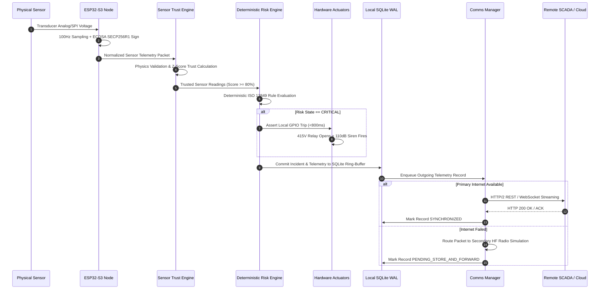

# 🔄 Sentinel-X Canonical Data Flow & Store-and-Forward Protocol

**Document Version:** 2.4.0  
**Specification:** End-to-End Packet Lifecycle & Disruption-Tolerant Store-and-Forward Architecture  
**Core Guarantee:** *Zero packet loss during communication blackouts.*

---

## 1. Canonical Telemetry Pipeline



---

## 2. Telemetry Packet Specification

Every sensor node transmits structured binary or JSON packets containing mandatory integrity headers:

```json
{
  "packet_header": {
    "node_id": "ESP32_NODE_01",
    "sequence_num": 149204,
    "timestamp_epoch_ms": 1788915900000,
    "firmware_version": "v2.4.0-sil2",
    "crc32": "0x9E2B5A71",
    "ecdsa_signature": "MEQCIB3x9Z...eZqf"
  },
  "sensor_payload": [
    {
      "sensor_id": "PT100_MOTOR_TEMP",
      "param": "motor_temperature",
      "value": 68.5,
      "unit": "°C",
      "raw_adc": 2480,
      "snr_db": 42.1
    },
    {
      "sensor_id": "ADXL345_VIBRATION",
      "param": "bearing_vibration",
      "value": 2.4,
      "unit": "mm/s",
      "raw_adc": 1120,
      "snr_db": 38.5
    }
  ],
  "device_health": {
    "battery_soc_pct": 98.5,
    "internal_temp_c": 34.2,
    "wdt_reset_count": 0,
    "uptime_seconds": 86400
  }
}
```

---

## 3. Store-and-Forward State Machine

When external connectivity is compromised, Sentinel-X switches into an offline store-and-forward mode:

```
[Local Event Created]
         │
         ▼
     [PENDING]  ───(Network Check: Online)───► [SENT] ───(Remote ACK)───► [SYNCHRONIZED]
         │                                       ▲
         │ (Network Check: Offline)              │ (Network Restored)
         ▼                                       │
     [RETRYING] ─────────────────────────────────┘
         │
         ▼ (Max Retries / Blackout Continued)
  [LOCAL_PERSISTED] (Held in SQLite WAL & USB Blackbox)
```

### State Definitions:
1. **`PENDING`**: Packet validated and stored in local SQLite database; awaiting transmission dispatch.
2. **`RETRYING`**: Transmission attempted; no ACK received within 1500ms; exponential backoff active.
3. **`SENT`**: Dispatched via available physical transport (IP, HF Radio, or Satellite).
4. **`ACKNOWLEDGED`**: Remote receiving station confirmed receipt with matching cryptographic CRC.
5. **`SYNCHRONIZED`**: Packet acknowledged and archived into local historical tables.
